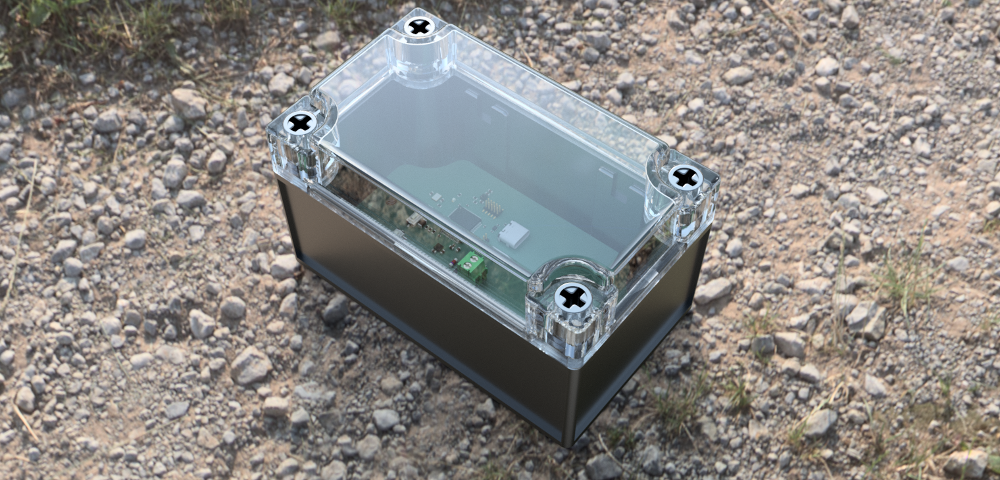
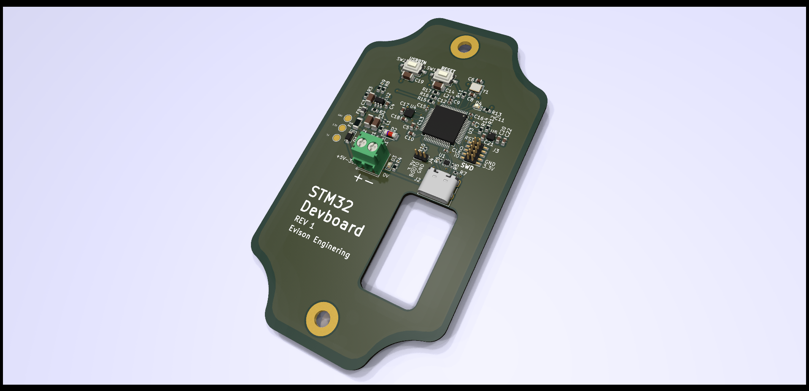

# STM32_DEVBOARD
Development board for STM32 microcontroller

Board features a STM32F401RCT6 MCU with a number of peripherals.
- Temperature Humidity Pressure Sensor (Bosch BME280)
- Triple Axis Accelerometer (ST LIS2DW12)
- Tactile Button
- User LED
- USB-C COM Port
- 4-30 VDC input range

